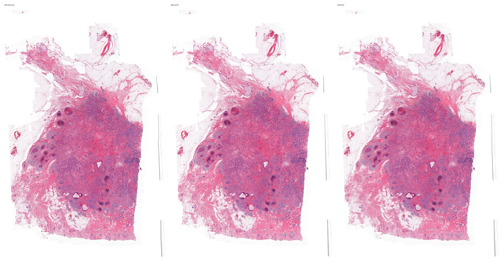
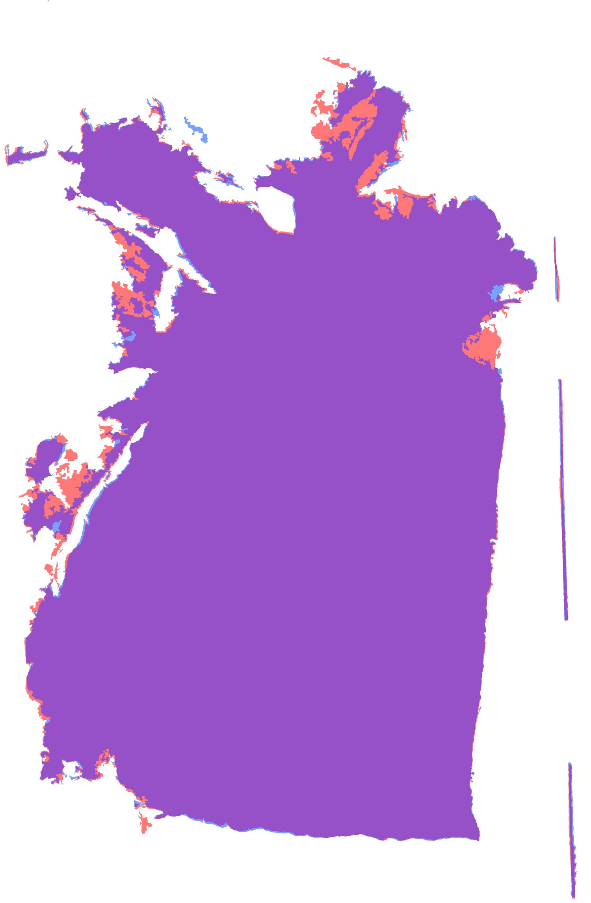
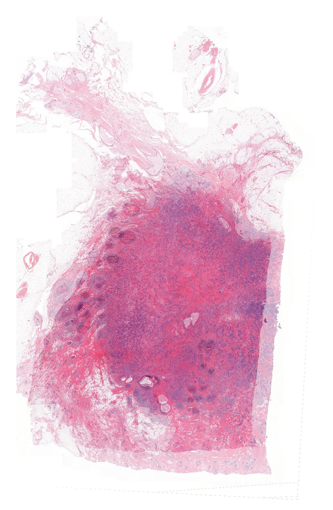

# Histology Registration for 3D Tissue Reconstruction

This repository is a public-facing portfolio page for my ongoing MSc thesis direction. It is written for PhD applications and research conversations, not as a full release of thesis data or internal code.

## Project Summary

My MSc thesis work focuses on preparing serial breast cancer histology sections for 3D tissue reconstruction, biomedical visualization, and later experimental analysis. The current computational step is image registration: bringing SVS-derived whole-slide histology images and corresponding reference images into a consistent spatial frame so the serial sections can later support 3D reconstruction and downstream tissue-level experiments.

The important point is that alignment is not the final goal. Registration is a preparation step for a larger workflow:

1. prepare histology image data,
2. test whether corresponding sections can be brought into a shared frame,
3. evaluate alignment quality visually and quantitatively,
4. build toward serial-section stacking,
5. support later 3D tissue reconstruction, biomedical visualization, and downstream tissue-level experiments.

## What The Work Currently Covers

- Reading and preparing SVS whole-slide images
- Working with lower-quality pre-aligned JPEG references
- Creating low-resolution representations for practical testing
- Generating tissue masks for early geometry checks
- Testing transform-transfer feasibility between SVS-derived and JPEG-derived image spaces
- Inspecting alignment through side-by-side views, alpha blends, and mask overlays
- Building toward internal feature QC using SIFT/RANSAC and deformation-aware refinement
- Using QuPath, Fiji/ImageJ, 3D Slicer, Photoshop, and Conda/Miniconda-supported Python environments for image inspection, workflow testing, figure preparation, and biomedical visualization

## Tools And Methods

- Python
- OpenSlide
- OpenCV
- SimpleITK
- NumPy, SciPy, Pillow
- Affine registration
- ECC refinement
- SIFT/RANSAC feature matching
- Tissue-mask and overlay-based visual QC
- QuPath, Fiji/ImageJ, and 3D Slicer
- Photoshop for figure preparation and visual inspection
- Conda / Miniconda for Python environment management

## Current Status

This is an ongoing MSc thesis project. The latest conservative result is a feasibility-stage workflow showing that an SVS/JPEG test pair can be compared and brought into a more useful shared frame at low resolution. Broader pipeline work is moving toward feature-based internal QC, safer deformation-aware refinement, and serial-section stacking.

Formal validation across more image pairs and higher-resolution or tiled stages is still part of the next work, so I avoid presenting the project as a finished method.

## Preliminary Visual Outputs

These figures are derivative, low-resolution, application-safe examples prepared for public portfolio use.

### SVS/JPEG Transform-Transfer Overview

### Tissue-Mask Overlay QC

### Serial-Section Blend Toward 3D Reconstruction

## Confidentiality

This public page intentionally avoids:

- raw thesis data,
- patient-level information,
- dataset identifiers,
- private supervisor or lab details,
- unpublished sensitive details,
- full internal implementation.

Any figures shown here are derivative, low-resolution, and application-safe. More detailed material can be shared only when appropriate and with supervisor approval.

## Why This Project Fits My PhD Direction

This project sits at the intersection of medical biotechnology, computational pathology, medical image analysis, and visual computing. It reflects the direction I want to grow into during a PhD: building computational tools that stay connected to tissue biology, pathology workflows, and visual quality control.
